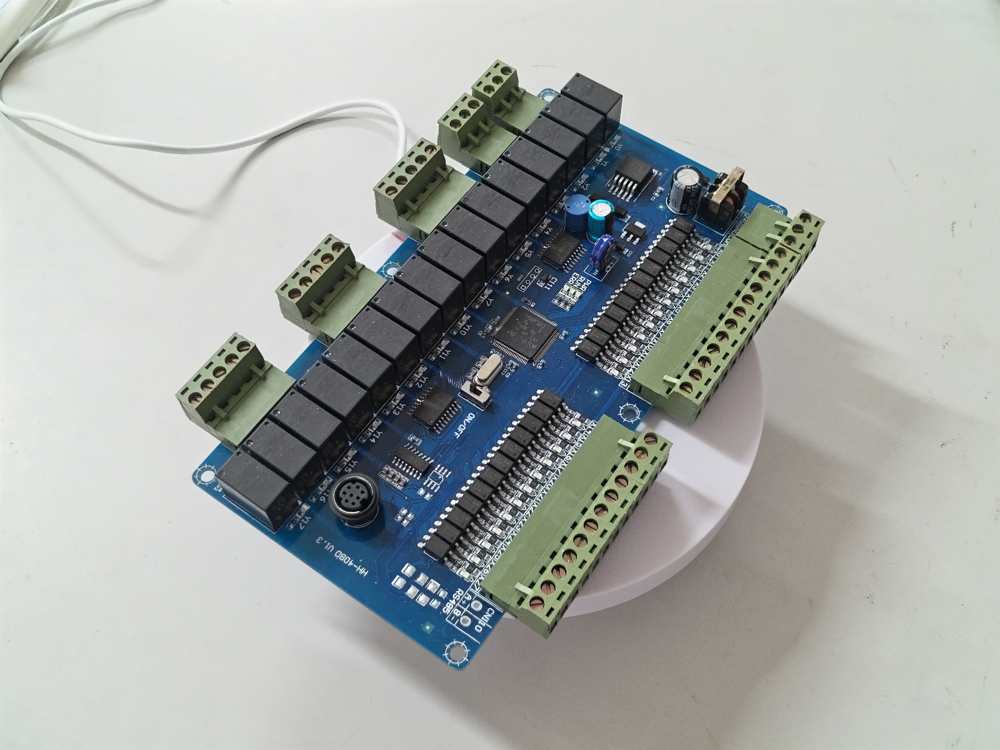
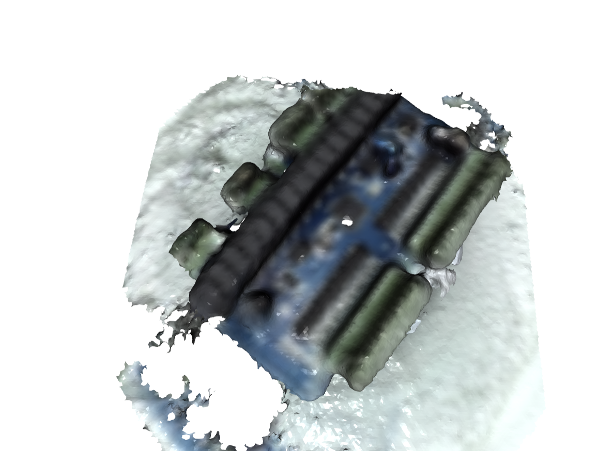

# RGB-D 转台三维重建

固定一台 RGB-D 相机，配合一个匀速转台，对 PCB 这类小物体做 360° 重建。核心是 TSDF 体素融合，用来替代早期的 ICP + 泊松方案。

换方案的直接原因有两个：转台只能常转、转速还不可控，没法靠角度去配准；电路板绿油反光，深度图大面积是 0。TSDF 融合对这两点都更耐受，没有累积漂移，也不用折腾相邻帧配准。

## 效果

<div align="center">
<table>
  <tr>
    <td align="center"></td>
    <td align="center"></td>
  </tr>
  <tr>
    <td align="center">电路板样品</td>
    <td align="center">重建结果</td>
  </tr>
</table>
</div>

## 硬件

| 部件 | 说明 |
|------|------|
| 相机 | Orbbec Astra Stereo S U3（SV1301S_U3），走 USB 3.0 |
| 转台 | 匀速旋转，一圈约 19s，通电常转，不能启停或步进 |
| 标定板 | 8×8 内角点棋盘格，方格边长 18mm |

相机一旦挪动，转轴标定就要重跑；标定结果只在「相机—转台」相对位置不变时有效。

## 安装

```bash
python -m venv .venv
.venv\Scripts\activate
pip install -r requirements.txt
# 可选，SAM2 前景分割用
pip install sam-2
```

## 使用流程

三步：转轴标定 → 扫描采集 + TSDF 融合 → 网格精修。

### 1. 转轴标定

棋盘格放转台中心，转台上电：

```bash
python src/acquisition.py calib   # 采集约 20 帧，覆盖 380°，存到 output/calibration/
python src/calibration.py         # 拟合空间圆解出转轴，输出 output/axis_params.json
```

验收标准：空间圆残差均值 ≤0.5mm、最大 ≤1.0mm；相邻帧重合误差中位 ≤2mm。

### 2. 扫描采集 + TSDF 融合

电路板放转台中心，转台上电：

```powershell
$env:FG_MOTION_ONLY = "1"   # 保留转台圆盘骨架当几何支撑
python src/scan_and_tsdf.py
```

采集约 100 帧（0.20s/帧，覆盖 380°），融合后输出 `output/result/pcb_tsdf.ply`。

已经采过帧、只想重跑融合：

```powershell
$env:TSDF_OFFLINE = "1"
python src/scan_and_tsdf.py
```

### 3. 网格精修

```bash
python src/refine_pcb_mesh.py
```

输出 `output/result/pcb_tsdf_refined.ply`，并弹窗对比（红=原始，蓝=精修）。

## 目录结构

```
.
├── assets/                   # 展示图片
├── skill/                    # AI 编码 Agent 的 skill 文件
├── src/                      # 业务代码
│   ├── acquisition.py        # 标定数据采集
│   ├── calibration.py        # 转轴解算（空间圆拟合 + 自检）
│   ├── camera_utils.py       # Orbbec SDK 封装
│   ├── scan_and_tsdf.py      # 主流程：采集 → TSDF 融合 → 后处理
│   ├── refine_pcb_mesh.py    # 网格精修（径向 + 厚度剔除 + 连通域）
│   ├── segment_foreground.py # 前景分割（中值背景 + 可选 SAM2）
│   └── mesh_render_views.py  # 正交视图离线渲染
├── config.py                 # 全局配置（相机参数、棋盘格、采集）
├── requirements.txt          # Python 依赖
├── .gitignore
└── README.md
```

`skill/` 目录为 AI 编码 Agent 的 skill 文件，便于 AI 工具操作项目；业务代码都在 `src/` 下。

## 关键参数

都集中在 `config.py`，跑之前先确认这里：

| 参数 | 值 | 说明 |
|------|-----|------|
| turntable_full_cycle_sec | 19.2 | 转台一圈时间，务必用秒表实测后填入 |
| voxel_length | 2.0mm | TSDF 体素大小，越大桥连越强 |
| sdf_trunc | 15.0mm | TSDF 截断距离，约 7.5×体素 |
| 采集间隔 | 0.20s | 约 3.8°/帧，100 帧覆盖 380° |

## 已知问题

- Astra 只标定了 640×480 彩色 + 640×400 深度这一对，切 1280×720 彩色时内参全 0，不可用。
- 电路板绿油反光、高出圆盘 ≥5mm 的元件，深度都是 0，TSDF 融合不出这些细节。
- 最终板厚会被 TSDF 插值膨胀到 2.5~3.5mm（真实板厚 1.6mm）。

## 本机实测

| 指标 | 实测 |
|------|------|
| 转轴残差 | 0.167mm |
| 自检重合 | 0.380mm |
| Top1 连通域 | 99.9% |
| 径向最大 | 124.9mm |
